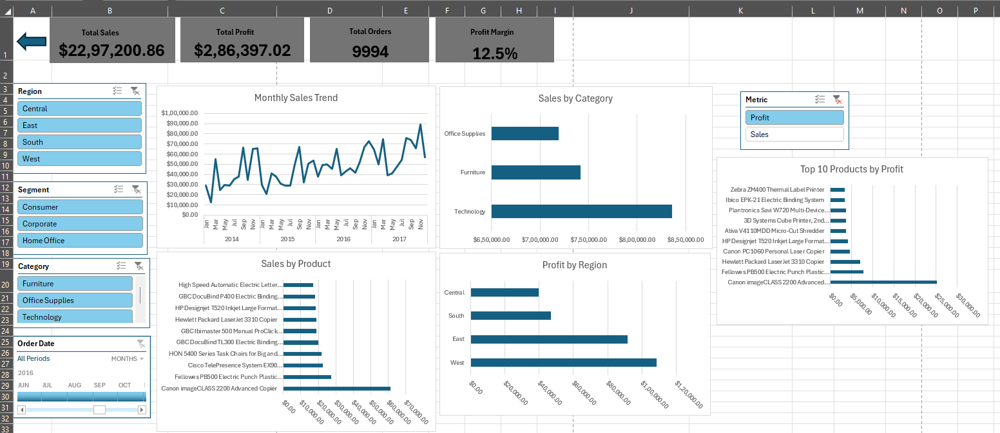
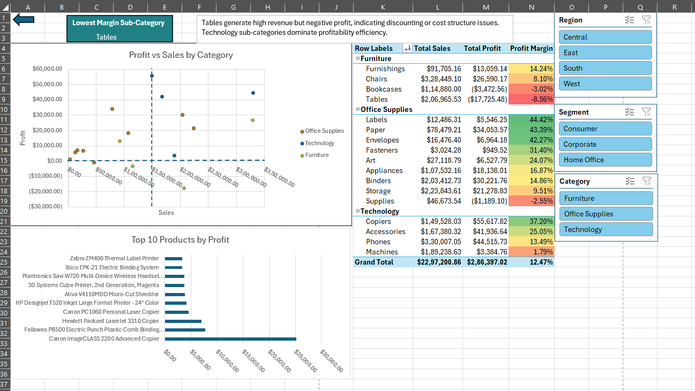
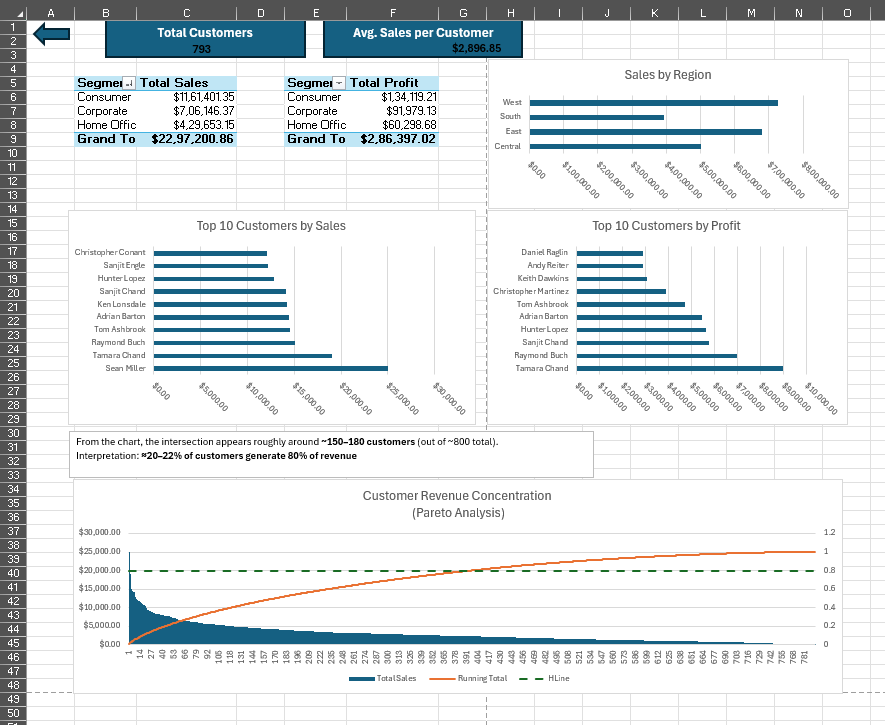
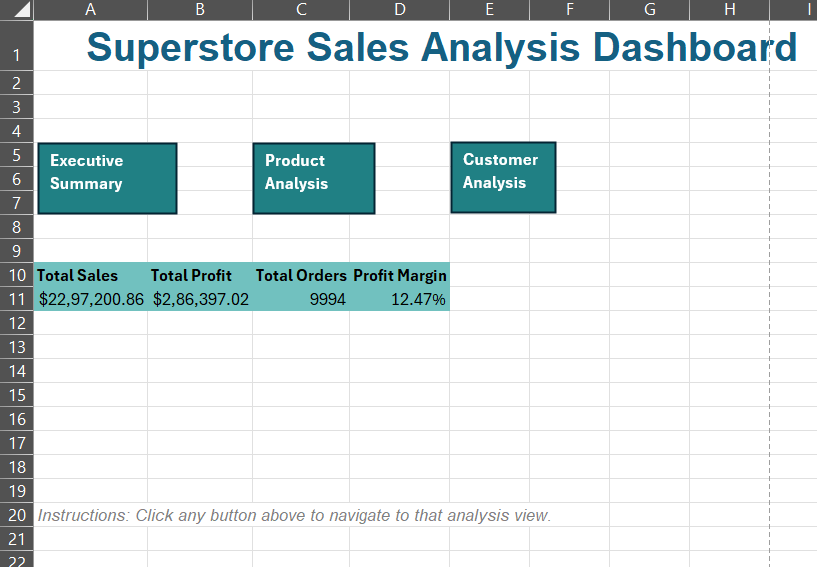

# Sales Performance Dashboard — Excel Project

## Project Overview

This project presents an interactive **Sales Performance Dashboard** built in Microsoft Excel using the **Superstore dataset**. The objective is to analyze sales, profitability, customer behavior, and product performance through a structured multi-page dashboard interface.

The solution demonstrates advanced Excel techniques commonly expected in Data Analyst roles, including PivotTables, slicers, KPI cards, lookup logic, and dashboard navigation design.

---

## Dashboard Structure

The workbook contains four main dashboard pages:

### 1. Executive Summary

Provides high-level performance indicators:

- Total Sales
- Total Profit
- Profit Margin
- Total Orders

Includes:

- Sales trend over time
- Regional performance comparison
- Segment-wise contribution
- Category-level distribution

---

### 2. Product Performance Page

Analyzes category and sub-category effectiveness.

Includes:

- Top-performing products by sales
- Lowest profit margin sub-categories
- Category-wise profitability comparison
- Product contribution breakdown

**Key business questions answered:**

- Which product categories drive revenue?
- Which sub-categories reduce profitability?
- Where should inventory investment increase or decrease?

---

### 3. Customer Performance Page

Focuses on customer-level insights.

Includes:

- Unique customer count
- Top customers by revenue
- Segment profitability comparison
- Regional customer distribution
- Pareto-style contribution analysis (high-value customers)

**Key business questions answered:**

- Who are the most valuable customers?
- Which segments generate the most profit?
- How concentrated is revenue among customers?

---

### 4. Navigation Page

Provides a structured entry point to the dashboard.

Features:

- Button-based navigation
- Clean report-style interface
- Default landing sheet on workbook open

Improves usability and simulates real BI dashboard workflows.

---

## Tools and Excel Features Used

This project demonstrates practical analyst-level Excel capabilities.

### Data Modeling

- Excel Tables
- Structured references
- Named ranges

### Analysis

- PivotTables
- PivotCharts
- Slicers
- Timeline filters

### Formulas

- INDEX + MATCH
- UNIQUE
- COUNTA
- IF logic
- Aggregation formulas

### Dashboard Techniques

- Dynamic titles
- Conditional formatting
- Interactive filtering
- Sheet navigation buttons

---

## Key Insights Generated

Examples of insights supported by the dashboard:

- Identification of high-revenue customer segments
- Detection of low-margin product sub-categories
- Regional performance comparison
- Category-level contribution to total sales
- Customer concentration effects on revenue stability

---

## Dataset

**Source:** Superstore dataset: https://www.kaggle.com/datasets/vivek468/superstore-dataset-final

---
